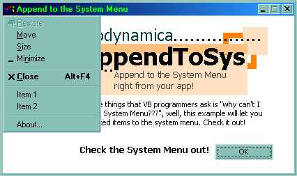



## Append to the System Menu

### Description

This is an example that shows you how to append unlimited items to the system menu! Reach where you couldn't reach before...
 
### More Info
 

             |
---                |---
**Submitted On**   |2000-10-18 20:35:14
**By**             |[Aaron Chan](https://github.com/Planet-Source-Code/PSCIndex/blob/master/ByAuthor/aaron-chan.md)
**Level**          |Intermediate
**User Rating**    |4.4 (22 globes from 5 users)
**Compatibility**  |VB 5\.0, VB 6\.0
**Category**       |[Miscellaneous](https://github.com/Planet-Source-Code/PSCIndex/blob/master/ByCategory/miscellaneous__1-1.md)
**World**          |[Visual Basic](https://github.com/Planet-Source-Code/PSCIndex/blob/master/ByWorld/visual-basic.md)
**Archive File**   |[CODE\_UPLOAD1077010192000\.zip](https://github.com/Planet-Source-Code/aaron-chan-append-to-the-system-menu__1-12141/archive/master.zip)

